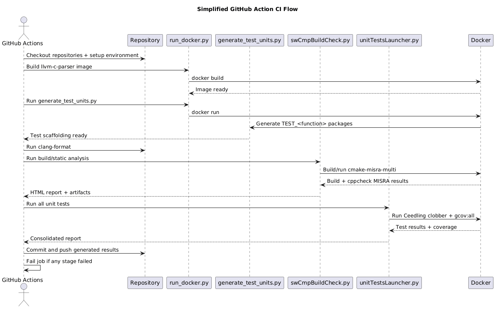

# CI Pipeline – Automated Unit Testing for C Projects

This repository contains a CI pipeline designed to automatically generate, build, and execute unit tests for C software components.  
The pipeline integrates static analysis, automated test scaffolding, and coverage-enabled unit test execution.

The workflow runs through **GitHub Actions** and leverages **Docker-based tooling** to ensure reproducible builds and analysis.

---

## CI Pipeline Overview

The following diagram illustrates the complete CI workflow.



---

## Pipeline Stages

### 1. Repository Setup
The CI job performs the following steps:
- Checkout the target repository
- Checkout the `unitTestLauncher` helper repository
- Install required tools (Python, clang-format)
- Prepare the Docker environment

---

### 2. Automatic Unit Test Generation
The script `generate_test_units.py` scans the source code and:

- parses C files using **libclang**
- detects functions and dependencies
- creates a test package for each function

Generated structure example:

```

TEST_FunctionName/
├── src/
│   └── FunctionName.c
└── test/
└── test_FunctionName.c

```

This step runs inside a Docker container (`llvm-c-parser`) to ensure consistent parsing.

---

### 3. Code Formatting
All `.c` and `.h` files are formatted using **clang-format** to enforce coding style consistency.

---

### 4. Build and Static Analysis
The script `swCmpBuildCheck.py` performs:

- component build validation
- generation of CMake build configuration
- execution of **cppcheck** static analysis
- MISRA-style rule checking
- generation of HTML reports

This stage runs in the Docker image `cmake-misra-multi`.

---

### 5. Unit Test Execution
The script `unitTestsLauncher.py`:

- prepares unit-under-test sources
- injects the real function implementation
- splits Unity test cases into executable units
- executes tests with **Ceedling**
- generates coverage reports (`gcov`)

All tests run inside the **MadScienceLab Ceedling Docker container**.

---

### 6. Results and Reporting
The pipeline collects and publishes:

- unit test results
- coverage reports
- static analysis reports
- consolidated test result summary

Artifacts are committed back to the repository for traceability.

---

## Main Scripts

| Script | Role |
|------|------|
| `run_docker.py` | Docker orchestration helper |
| `generate_test_units.py` | Automatic test scaffolding generation |
| `swCmpBuildCheck.py` | Build validation and static analysis |
| `unitTestsLauncher.py` | Unit test preparation and execution |
| `common_utils.py` | Shared utilities used by all scripts |

---

## Technologies Used

- **GitHub Actions**
- **Docker**
- **libclang**
- **Ceedling / Unity**
- **cppcheck**
- **clang-format**
- **gcov**

---

## Goal

The goal of this CI pipeline is to provide:

- automated unit test generation
- repeatable test execution
- early detection of build issues
- integrated static analysis
- reproducible Docker-based builds

This approach helps maintain high software quality and ensures that every code change is validated automatically.
```


